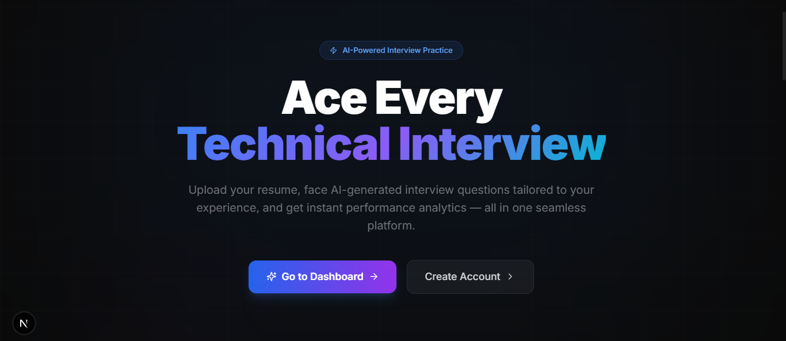

# 🧠 AI Mock Interviewer

> **An automated, AI-driven technical screening platform that evaluates engineers based strictly on their unique technical footprint.**



## 📖 The Vision

Technical interviews shouldn't be a one-size-fits-all algorithm test. They should test a candidate's actual experience. 

This platform acts as a strict Senior Staff Engineer. Instead of generic questions, the custom **Go (Fiber)** backend natively parses a candidate's uploaded resume and orchestrates the **Google Gemini 2.5 Flash API** to generate bespoke, highly technical questions tailored *exactly* to the stack and experience listed in the PDF.

## ✨ Key Features

* ⚡ **In-Memory PDF Parsing:** Pure Go-based PDF extraction, completely bypassing heavy external document parsing services to drastically reduce latency.
* 🤖 **Dynamic AI Generation:** Enforces strict JSON MIME-type constraints on Gemini 2.5 Flash to generate reliable, structured interview questions and grading analytics.
* ⏱️ **The "Pressure Cooker" Room:** A cinematic, glassmorphic Next.js interview room featuring a strict 15-minute countdown timer, state management, and auto-submission.
* 📊 **Deep Analytics Engine:** A dedicated grading pipeline that analyzes candidate responses against the generated questions, returning an overall score, key strengths, and detailed line-by-line feedback.
* 🔐 **Secure Infrastructure:** Backed by **Supabase** storage with custom Row-Level Security (RLS) policies to ensure resume privacy.

## 🛠️ Tech Stack

**Frontend (The Client)**
* **Framework:** Next.js (React)
* **Styling:** Tailwind CSS (Deep Dark Mode / Glassmorphism)
* **Animations:** Framer Motion
* **Icons:** Lucide-React

**Backend (The Engine)**
* **Server:** Go (Fiber Framework)
* **AI Integration:** Google Generative AI Go SDK (Gemini 2.5 Flash)
* **File Processing:** `github.com/ledongthuc/pdf`

**Infrastructure & Database**
* **Containerization:** Docker & Docker Compose (Multi-stage builds)
* **Database/Storage:** Supabase (PostgreSQL & Object Storage)

---

## 🚀 Getting Started

Because the entire ecosystem is containerized, you can spin up the Next.js frontend, the Go API, and the internal networking with a single command.

### 1. Prerequisites
* [Docker Desktop](https://www.docker.com/products/docker-desktop) installed and running.
* A Gemini API Key from [Google AI Studio](https://aistudio.google.com/).
* A [Supabase](https://supabase.com/) project with a `resumes` storage bucket created.

### 2. Environment Variables
Create a `.env` file in the root of the project (or inside your specific folders depending on your setup) and add the following:

```env
# Go Backend Variables
GEMINI_API_KEY=your_gemini_api_key_here

# Next.js Frontend Variables
NEXT_PUBLIC_SUPABASE_URL=your_supabase_project_url
NEXT_PUBLIC_SUPABASE_ANON_KEY=your_supabase_anon_key

### 3.Quick Start DOCKER
# Clone the repository
git clone [https://github.com/yourusername/ai-mock-interviewer.git](https://github.com/yourusername/ai-mock-interviewer.git)
cd ai-mock-interviewer

# Build and start the containers
docker-compose up --build

###MANUAL SETUP
//Frontend
cd api
go mod tidy
go run main.go

//Backend
cd frontend
npm install
npm run dev

###SUPABASE SECURITY POLICY
-- Allow users to upload resumes
CREATE POLICY "Allow authenticated users to upload resumes"
ON storage.objects FOR INSERT TO authenticated WITH CHECK (bucket_id = 'resumes');

-- Allow the system to read resumes
CREATE POLICY "Allow authenticated users to read resumes"
ON storage.objects FOR SELECT TO authenticated USING (bucket_id = 'resumes');